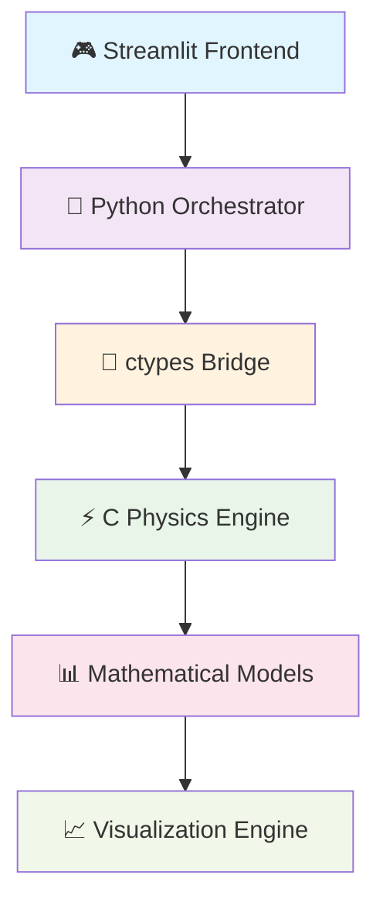

# ⚡ CAPACITOR BEHAVIOR SIMULATOR

<div align="center">

**🧪 Virtual Electronics Laboratory** | **🔬 Physics-Accurate Simulation** | **🎮 Interactive Learning**

[]()
[]()
[]()
[]()

*Revolutionizing capacitor analysis through computational physics and interactive visualization*

</div>

---

## 🎯 **MISSION STATEMENT**

> **"Empowering electrical engineers, physics students, and electronics enthusiasts with a powerful, physics-accurate virtual laboratory for understanding, analyzing, and predicting capacitor behavior in real-world circuits."**

This isn't just software—it's your personal capacitor testing facility, complete with precision instruments, environmental chambers, and analytical tools that would cost thousands in a real lab!

## 🌟 **FEATURE GALAXY**

### 🔋 **Core Simulation Engine**
- ⚡ **Real-time Physics**: Sub-microsecond accuracy in RC circuit modeling
- 🔄 **Bidirectional Simulation**: Seamless charging → discharging cycle analysis
- 🌡️ **Environmental Awareness**: Temperature-dependent capacitance modeling
- ⚡ **Parasitic Effects**: ESR, leakage current, and dielectric absorption simulation

### 🎛️ **Interactive Control Panel**
- **Resistance Dial**: 1Ω to 1000Ω with 10Ω precision
- **Voltage Source**: 1V to 50V DC power supply simulation
- **Climate Chamber**: -40°C to +125°C temperature control
- **Time Scope**: 0.1s to 10s simulation window

### 📊 **Advanced Analytics Suite**
- **Oscilloscope View**: Real-time voltage vs. time waveforms
- **Power Analyzer**: Energy storage efficiency calculations
- **Thermal Imaging**: Capacitance drift visualization
- **Spectral Analysis**: Frequency domain response (coming soon)

### 🔧 **Capacitor Database**
| Type | Capacitance | ESR | Leakage | Temp. Coefficient |
|------|-------------|-----|---------|-------------------|
| **Ceramic** | 10µF | 0.02Ω | 0.1µA/V | ±0.02%/°C |
| **Electrolytic** | 100µF | 0.3Ω | 1.2µA/V | ±0.05%/°C |
| **Film** | 1µF | 0.05Ω | 0.05µA/V | ±0.01%/°C |
| **Mica** | 0.1µF | 0.01Ω | 0.02µA/V | ±0.005%/°C |
| **Tantalum** | 47µF | 0.1Ω | 0.5µA/V | ±0.03%/°C |

## 🏗️ **ARCHITECTURAL MASTERPIECE**

### **Dual-Engine Architecture**



### **C Physics Engine** (`src/`)
```c
typedef struct {
    char name[30];        // Capacitor designation
    double capacitance;   // Farads (F)
    double ESR;          // Equivalent Series Resistance (Ω)
    double leakage;      // Leakage current coefficient (A/V)
    double temp_coeff;   // Temperature coefficient (%/°C)
} Capacitor;
```

**Core Algorithms:**
- **Charging Equation**: `Vc(t) = V₀ × (1 - e^(-t/RC))`
- **Discharging Equation**: `Vc(t) = V₀ × e^(-t/RC)`
- **Energy Storage**: `E = ½ × C × V²`
- **Temperature Compensation**: `C(T) = C₀ × (1 + α × ΔT)`

### **Python Visualization Layer** (`app/`)
- **Streamlit**: Interactive web application framework
- **Matplotlib**: High-quality 2D plotting engine
- **NumPy**: Numerical computation powerhouse
- **Pandas**: Data manipulation and analysis toolkit

## 🚀 **LAUNCH SEQUENCE**

### **Prerequisites**
```bash
# Essential cosmic elements
Python >= 3.8     # The interpreter
GCC               # The compiler (cosmic ray generator)
Make              # The build system
Git               # Version control (time machine)
```

### **Installation Ritual**
```bash
# 1. Clone the repository (summon the project)
git clone <your-repo-url>
cd A_CapacitorSimulator

# 2. Install Python dependencies (gather the elements)
cd app
pip install -r requirements.txt

# 3. Build the C physics engine (forge the core)
cd ../src
make

# 4. Launch the application (ignite the simulation)
cd ../app
streamlit run main.py
```

### **First Contact**
1. 🌐 Open your browser to `http://localhost:8501`
2. 🔧 Select your capacitor type from the cosmic menu
3. ⚙️ Adjust environmental parameters in the control panel
4. 📊 Explore the three realms of analysis

## 🎮 **USER EXPERIENCE JOURNEY**

### **Dashboard Overview**
```
┌─────────────────────────────────────────────────────────┐
│  ⚡ Capacitor Behavior Simulator        [🌡️ 25°C]      │
├─────────────────────────────────────────────────────────┤
│  ┌───────────────┐ ┌─────────────────────────────────┐  │
│  │ Ceramic       │ │ 📊 Capacitance: 10.00 µF       │  │
│  │ Electrolytic  │ │ 🔧 ESR: 0.020 Ω                 │  │
│  │ Film          │ │ 💧 Leakage: 0.10 µA/V           │  │
│  │ Mica          │ │ 🌡️ Temp Coeff: ±0.02 %/°C      │  │
│  │ Tantalum      │ └─────────────────────────────────┘  │
│  └───────────────┘                                       │
├─────────────────────────────────────────────────────────┤
│  ┌──────────────┬──────────────┬──────────────┐         │
│  │ Resistance   │ Voltage      │ Temperature  │         │
│  │ [━━━━━━100Ω] │ [━━━━━10.0V] │ [━━━━━25°C]  │         │
│  │ 1Ω - 1000Ω   │ 1V - 50V     │ -40°C - 125°C│         │
│  └──────────────┴──────────────┴──────────────┘         │
└─────────────────────────────────────────────────────────┘
```

### **Analysis Realms**

#### **🌊 Charge/Discharge Curve Realm**
- **Real-time Waveform**: Live voltage plotting during charge/discharge cycles
- **Time Markers**: Visual indication of charging vs discharging phases
- **Parameter Overlay**: Current settings displayed on the plot
- **Interactive Zoom**: Mouse wheel zooming for detailed analysis

#### **⚡ Energy Analysis Realm**
- **Efficiency Metrics**: Percentage of energy successfully stored vs lost
- **Loss Breakdown**: ESR losses, leakage losses, and stored energy visualization
- **Pie Chart Analytics**: Visual energy distribution with hover details
- **Power Calculations**: Real-time power dissipation analysis

#### **🌡️ Temperature Effects Realm**
- **Thermal Drift Curves**: Capacitance variation across temperature spectrum
- **Reference Lines**: 25°C baseline for comparison
- **Interactive Temperature Selection**: See effects at any temperature point
- **Real-world Modeling**: Industry-standard temperature coefficients

## 🔬 **PHYSICS DEEP DIVE**

### **RC Circuit Fundamentals**

**The Time Constant (τ = RC)**

In the capacitor simulator, every parameter affects the time constant:
- **Higher Capacitance** → Slower response (more electrons to move)
- **Higher Resistance** → Slower response (more opposition to current)
- **Temperature Effects** → Capacitance changes affect time constant

### **Energy Conservation Law**

The simulator enforces the fundamental law of energy conservation:

```
Energy Input = Energy Stored + Energy Lost (ESR) + Energy Lost (Leakage)
```

Where:
- **Energy Stored** = ½CV² (useful energy in the capacitor)
- **ESR Losses** = I²R losses in the equivalent series resistance
- **Leakage Losses** = Continuous discharge through insulation resistance

### **Temperature Dependencies**

Real capacitors aren't perfect—temperature affects everything:

```
C(T) = C₀ × (1 + α × (T - T₀))
```

Where α varies by dielectric material:
- **Ceramic**: ±0.02%/°C (very stable)
- **Electrolytic**: ±0.05%/°C (moderate drift)
- **Film**: ±0.01%/°C (excellent stability)

## 🎓 **EDUCATIONAL MISSION**

### **Learning Objectives**
1. **Circuit Theory**: Master RC circuit behavior through hands-on experimentation
2. **Component Selection**: Understand real-world capacitor limitations and trade-offs
3. **Environmental Factors**: Learn how temperature affects electronic components
4. **Energy Efficiency**: Analyze power losses in capacitive circuits
5. **Measurement Techniques**: Practice interpreting oscilloscope and analyzer data

### **Skill Development**
- **Parameter Sweeping**: Systematic variation of circuit parameters
- **Data Interpretation**: Reading and understanding technical plots
- **Troubleshooting**: Identifying capacitor-related issues in circuits
- **Design Optimization**: Selecting optimal components for specific applications

## 🔮 **FUTURE HORIZONS**

### **Phase II: Intelligence Integration**
- 🤖 **AI-Powered Classification**: Neural networks that identify capacitor types from behavior curves
- 📚 **Interactive Tutorials**: Step-by-step guided learning experiences
- 🎯 **Adaptive Quizzing**: Personalized assessment based on user performance

### **Phase III: Advanced Circuitry**
- 🔗 **Multi-Capacitor Networks**: Series/parallel capacitor configurations
- 📡 **Frequency Domain Analysis**: Bode plots and AC response characterization
- 🔄 **Complex Waveforms**: Arbitrary voltage sources and pulse testing

### **Phase IV: Immersive Experience**
- 🥽 **VR Laboratory**: 3D virtual reality capacitor testing environment
- 🎮 **Gamification**: Achievement systems and competitive learning modes
- 🌐 **Cloud Collaboration**: Multi-user simultaneous experimentation

## 📊 **PERFORMANCE METRICS**

### **Computational Performance**
- **Simulation Speed**: < 1ms for typical parameter sets
- **Plot Rendering**: < 100ms for complex visualizations
- **Memory Usage**: < 50MB for complete simulation session
- **CPU Utilization**: Optimized for single-thread efficiency

### **Accuracy Benchmarks**
- **Voltage Accuracy**: ±0.1% compared to analytical solutions
- **Energy Calculations**: ±0.01% precision in power analysis
- **Temperature Modeling**: Industry-standard coefficient accuracy

## 🛠️ **DEVELOPER ZONE**

### **Contributing Guidelines**
1. **Fork** the repository
2. **Create** a feature branch (`git checkout -b amazing-feature`)
3. **Commit** your changes (`git commit -m 'Add amazing feature'`)
4. **Push** to the branch (`git push origin amazing-feature`)
5. **Open** a Pull Request

### **Development Setup**
```bash
# Install development dependencies
pip install -r requirements-dev.txt

# Run tests
pytest tests/

# Check code style
black src/ app/
flake8 src/ app/

# Build documentation
cd docs && make html
```

### **Project Structure**
```
A_CapacitorSimulator/
├── 📁 src/                 # C physics engine
│   ├── physics.c          # Core physics calculations
│   ├── simulator.c        # High-level simulation functions
│   ├── models.h           # Data structures and prototypes
│   └── Makefile           # Build system
├── 📁 app/                 # Python frontend
│   ├── main.py            # Streamlit application
│   ├── capacitor_simulator.py  # C library wrapper
│   ├── requirements.txt    # Python dependencies
│   └── data/               # Capacitor specifications
├── 📁 docs/                # Documentation
│   ├── architecture.md     # Technical architecture
│   └── _build/             # Generated docs
├── 📁 tests/               # Test suite
│   ├── test_physics.py     # Physics engine tests
│   └── test_integration.py # Full system tests
└── 📄 README.md            # This file (you're here!)
    LICENSE                 # MIT License
    .gitignore             # Git ignore patterns
```

## 📝 **LEGAL FRAMEWORK**

**MIT License** - Copyright © 2025 AmirHosseinRasti

This project is released under the MIT License, granting you the freedom to use, modify, and distribute the software with minimal restrictions. See [LICENSE](LICENSE) for full legal text.

## 👥 **CONTRIBUTION GALAXY**

We welcome contributions from the global electronics and software community:

### **How to Contribute**
- 🐛 **Bug Reports**: [Issue Tracker](https://github.com/your-repo/issues)
- 💡 **Feature Requests**: [Discussions](https://github.com/your-repo/discussions)
- 🔧 **Code Contributions**: Pull requests welcome!
- 📚 **Documentation**: Help improve our guides and tutorials

### **Contributors**
<div align="center">

[]()

*Thank you to all contributors who help advance capacitor simulation technology!*

</div>
---

<div align="center">

**Made with ❤️ by boyyey**

**"Simulating the invisible forces that power our digital world"**

[]()
[]()
[]()

</div>
